八股 算法 算法 项目 实习 学历 科研 竞赛 开源 个人博客  剑指offer hot100


</br>


jetbrain 快捷键:
https://www.bilibili.com/video/BV1dL411E7Qg/?vd_source=4b9929a93a68ea46743a8ef1b0d86cba

ctrl+/ 注释    ctrl+D  shift + ctrl+↑...  

关掉提示区分大小写  注释改为绿色   加入自动导入包

右.左操作   :
"helloworld".sout
boolean flag = true;   flag.while   循环
int[] x ={...};  x.for   迭代
...


cmd 常用命令cmd
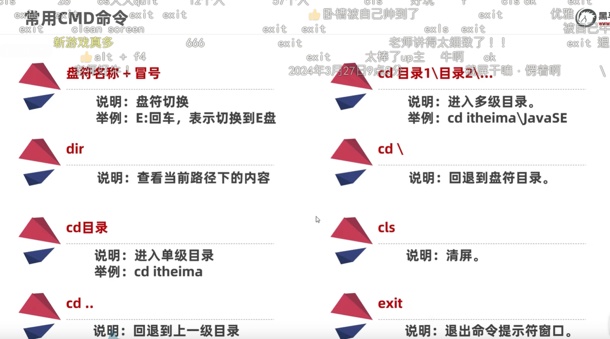
环境变量Path 让cmd等能直接找到 不用在相应目录启动cmd;  

安装路径一般不要中文 因为中文菜 就多练;
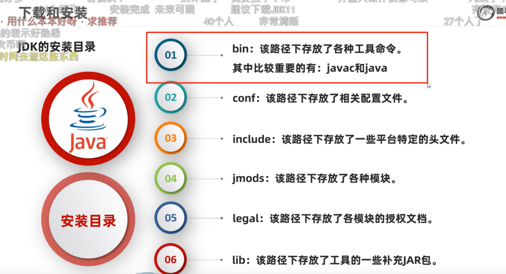

bug 的历史 : oh bug     卧槽


%appdata%   类似与 #define ...    是个预处理变量


制表符  \t  把前边的内容补齐到8或者8的倍数
name    185
abc     456        能够好看  对其    

数据类型:
byte 8bit   short 16bit   int 32bit   long  64bit
float 32bit    double 64bit
char 32bit  
long x =9999999999L
float x  =10.34F
double x= 12.434      long  double 需要加后缀  因为java 默认 int 和double
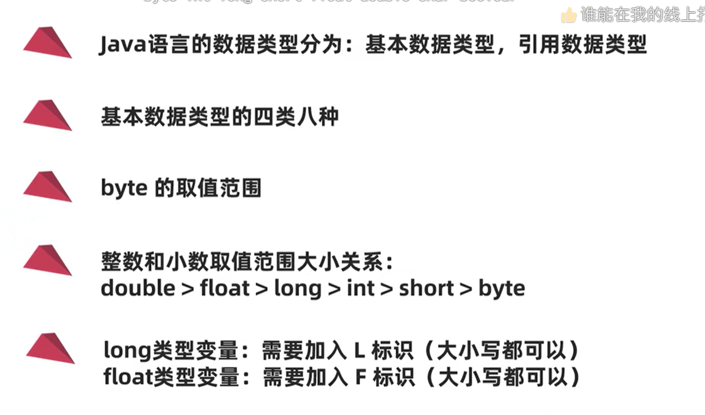

identifier 和C语言类似
Alibaba 变量命名规范:
小驼峰命名  变量 方法:   name   firstName    secondDadName
大驼峰命名  类:   Student    GoodStudent


全是整数 / 是整除   有小数就是除法
隐式转换
不同数据类型运算 小的转换为大的取值范围 eg.  'A'+10==75;   byte short char 直接转为int
强制转换
double x=12.3      (int)x==12;  截断

+  有数学和字符串串联两种运算

a++先用后加   ++a先加在用

逻辑运算
& 有0则0 ∩      | 有1则1  ∪      ^(异或)  相同false  不同 true    false 是空集
短路逻辑运算符   && 判断第一个有0直接返回0   ||同理    提高效率用的有概率不用判断第二个的boolean
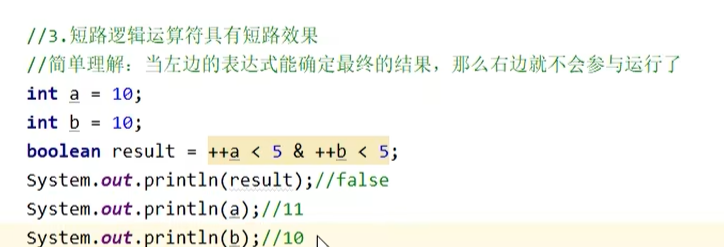

int x= a>b ? a : b;  三元表达式

if elseif  else   是个整体分支语句 一个成立其他的都不执行   if if if 是互相独立的;
int x= 0;  
switch(x){
    case 1,2,3:
    sout("123");
    break;
    case 0;
    sout("0")
    break;
    default:
    sout("...")
    break;
}


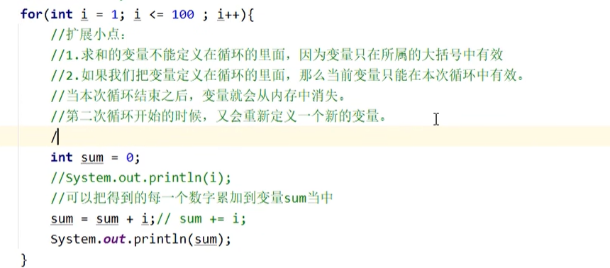

栈;

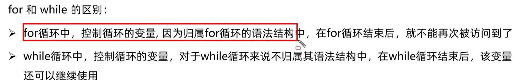


循环判断条件写开头 i++写结尾  写开头的好处是判断还用不用执行下次循环  i初值为0结尾写可以用数轴的点线段来考虑如何计数   这个处理方式 和for的一样
while(){

    ++;
}                   括号里取反 可加入break写入{}内达到相同的条件;
循环计数问题可以通过向量建立映射考虑 条件判断一定要写前边;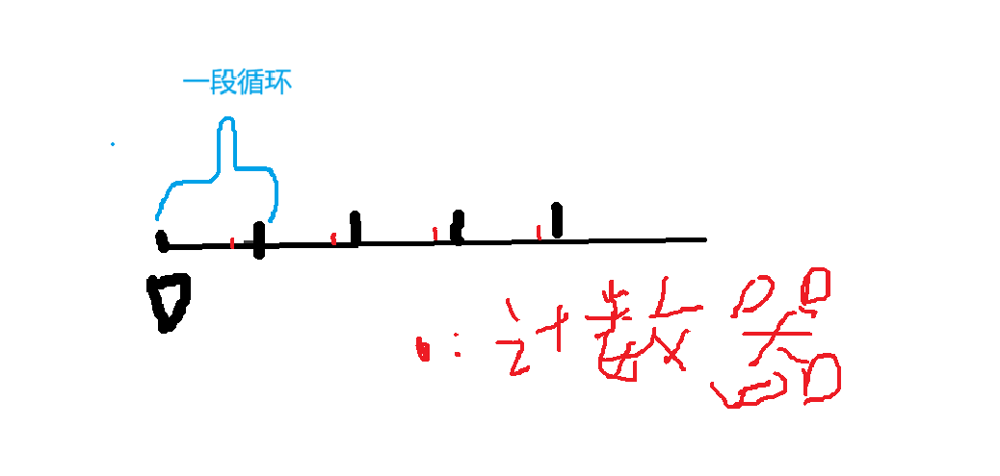


循环的flag变量  可以boolean 或者int  boolean
Random r =new Random() 
int number =r.nextInt(10);  //左闭右开 0~9;
7~15   int number = r. nextInt(9);

随机数用向量考虑
12~43     ->   0~31     nexInt()+12
1.5~5.7  ->    0.0~4.2    nextdouble*4.2+1.5


基本数据类型和引用数据类型
引用数据类型: String

int[] array=new int[] {1,2,3};
int[] array=new int[10]  10长度的空数组
int[] array= {1,2,3}
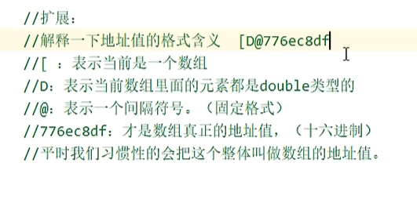
array.length


对象就是地址(指针)  new 出来的对象都是堆中的地址

int [] arr=new int[3];
arr.length
int []是一个特殊的对象

public static int f(int a,int b){}  public static int f(int a,int b);这叫方法的重载;
同一个类同名函数但参数不同(参数的类别多少顺序)的方法叫做重载,不用关注返回值相不相同,void int f  参数一样 也不是重载
相同功能的方法起成一个名字,进行方法重载

基本数据类型是栈中内存  引用数据类型是堆中的地址(指针)

---

面向对象,javabean类  测试类
类 构造的对象主要通过类的方法进行操作对象
类是将现实东西抽象出来的集合 用其中的成员变量表示属性 类的方法表示属性之间的关系 变量和方法总体构成类的结构 真想抽象代数
成员变量  成员变量能干什么叫做成员方法
对象代表什么,就得封装对应的数据,并提供数据对应的行为

private 成员变量 只能在本类中访问成员变量

this.age this使得变量是成员变量 否则就 就近原则
```
public class Nvpengyou {
    public Nvpengyou(){

    }
    public Nvpengyou(int age){
        this.age=age;
    }

    private int age;
    
    public int setAge(int age){
      if(age>18){
        this.age=age;
        return 0;
      }else{
        return -1;
      }
    }
    public int getAge(){
      return this.age;
    }

}
```

构造方法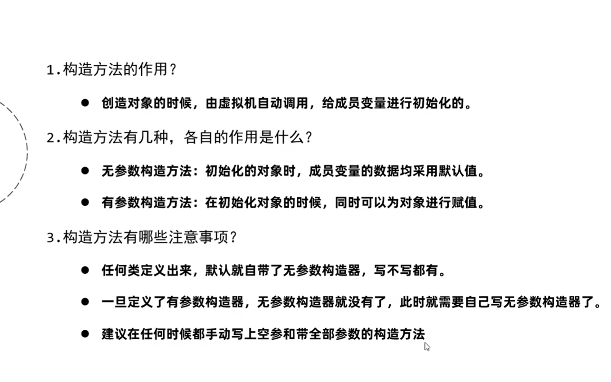 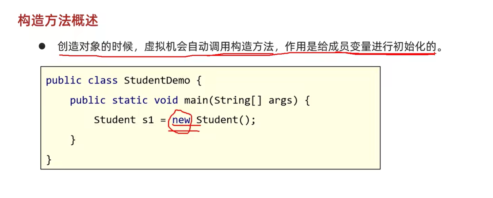
把空参构造和有参构造方法都写出来 因为项目是团队合作需要大家一起do
标准javabean类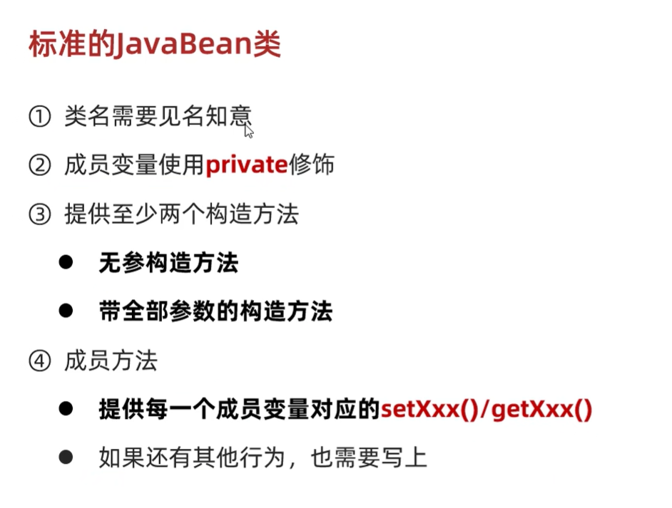
PTG插件 右键一键javabean

debug是个好东西 
static 静态是指不创建对象也能用的成员变量或者方法

Scanner sc=new Scanner(System.in)
sc.next()  nextInt() nextDouble() 遇到空格制表符 回车直接停止 和c中的输入流一样  nextLine() 仅遇到回车才停止

对象数组
Car[] arr=new Car[3];
Scanner sc=new Scanner(System.in)
for(int i=0;i<4;i++){
    Car c=new Car();
    String brand=sc.next();
    c.setBrand(brand);
    arr[i]=c;
}

## String
.length()  .charAt(i)  +
.append() .reverse() .length()
构造方法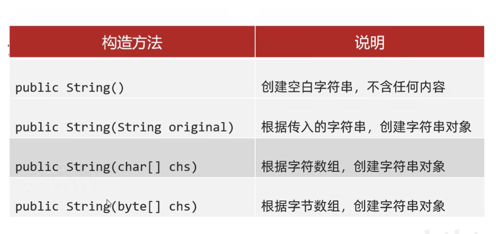 后边两种可参考C语言中的字符串没有\0

String s1.equals(String s2);equalsIgnoreCase()忽略大小写
sout("**"+i+"**")  sout可以这样用
str.length  str.charAt(i) 字符串的索引 相对于 C语言的 字符串数组索引
```
//统计字符串的个数
  String str=new String("aabb");
        int[] sum=new int[1001];
        for (int i=0;i<str.length();i++){
            sum[(int)str.charAt(i)]+=1;
        }
        System.out.println(sum[97]+" "+sum[98]);
//字符串反转
public static String fanZhuan(String str){
        String str1=new String("");
        for(int i=str.length()-1;i>=0;i--){
            str1=str1+str.charAt(i);

        }return str1;
```

字符串的拼接 + 运算符能智能把类型转换成String "a"+int i=="ai"

StringBuilder String容器 String 效率低不可变化 而这个容器类可以变化
仅在字符串拼接和反转需要用到StringBuilder
```
StringBuilder sb=new StringBuilder("abc");
sb.append("");
sb.reverse();
sb.length();


String str=new String("1221");
StringBuilder sb=new StringBuilder();
sb.append(str);//加入到容器中
sb.reverse();
sb.toString();//容器再变成字符串


```
数组是特殊的指针所以 length不是length() java的字符串很好操作因为有+运算符而且还有StringBuilder容器类可用

## ArrayList
集合和数组根本区别就是集合长度可变且集合里边是对象
集合不能存储基本数据类型仅能存引用数据类型 基本数据类型包装类可以存进去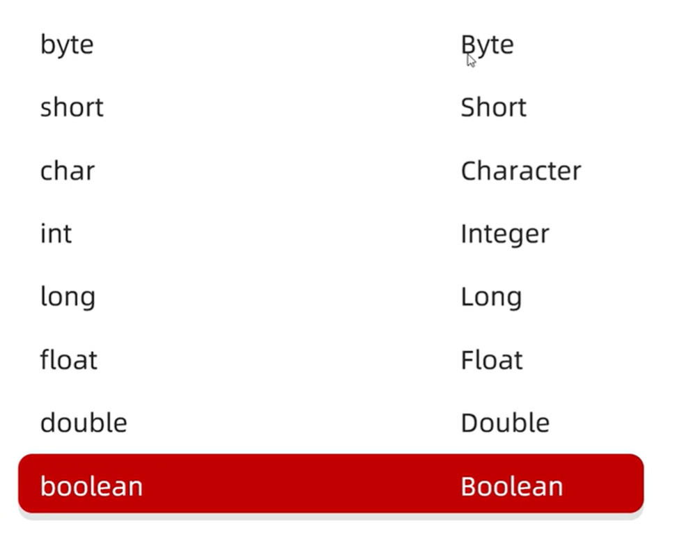
集合是一个容器为了方便数据机构 方法肯定有增删改查
ArrayList<String> list =new ArrayList<String>();
list.add("");增
list.remove(0);ist.remove("");删
list.set(0."aaa");改
list.get(0);查
list.size();

```
ArrayList<Integer> list=new ArrayList<Integer>()

```

## Math API

## 小算法
### 查找

#### 基本查找
```
 public static ArrayList<Integer> basicSearch(ArrayList<Integer> list,int tgt) {
        ArrayList<Integer> ret = new ArrayList<>();
        for (int i = 0; i < list.size(); i++) {
            if(list.get(i) == tgt) {
                ret.add(i);
            }
        }
        return ret;
    }
```
#### 二分查找
min mid man
```
//二分查找
    public static ArrayList<Integer> erfenSearch(ArrayList<Integer> list, int target) {
        ArrayList<Integer> ret=new ArrayList<>();
        int min=0;int max=list.size()-1;
        while(min<=max){   //注意是<=因为最后还要再判断一次>
            int mid=(max+min)/2;
            if(list.get(mid)==target){
                ret.add(mid);
                break;
            }
            else if(list.get(mid)>target){
                max=mid-1;
                min=min;
            }
            else{
                min=mid+1;
                max=max;
            }

        }
        return ret;
    }
```


