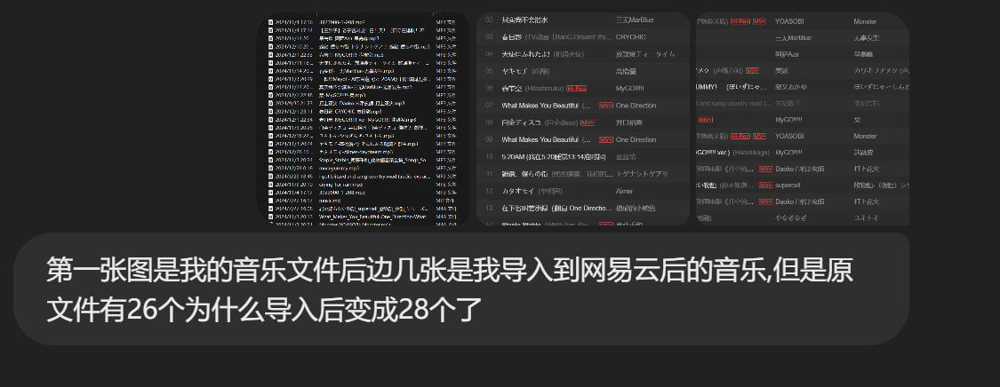

# 2024/12/28
- 
- 从你的文件和网易云音乐导入列表来看，文件数量增加的原因可能有以下几种情况：

1. **重复导入**：
   - 某些音乐文件可能在导入过程中被重复导入。例如，列表中可以看到 **“What Makes You Beautiful”** 和 **“Monster”** 都出现了两次。重复的文件会被算作多个文件。

2. **网易云音乐自动识别**：
   - 网易云音乐有可能对某些文件进行了自动分类或从其曲库中匹配到了额外的版本，导致显示的文件数比原文件夹多。

3. **格式问题**：
   - 如果文件夹中的某些音频文件存在不同的格式（如MP3、M4A等），网易云可能将其当作不同版本或重复文件导入。

4. **附加元数据**：
   - 某些文件可能包含不同的元数据（如专辑信息、演唱者不同），即便内容相同，网易云音乐可能将其识别为不同的文件。

5. **自动关联文件**：
   - 网易云可能关联了一些在线资源，例如根据音频文件自动补充了高质量版本或MV等信息，这会增加导入的数量。

### 解决方法：
- **检查重复文件**：查看网易云音乐中是否存在重复的音乐条目。如果有，可以手动删除。
- **检查导入日志**：在网易云音乐的导入设置中查看导入文件的详细信息。
- **对比文件**：将本地文件夹与网易云音乐的曲目列表进行逐个对比，找出新增的条目。

如果需要更进一步的分析，我可以帮你详细对比文件名或其他信息！