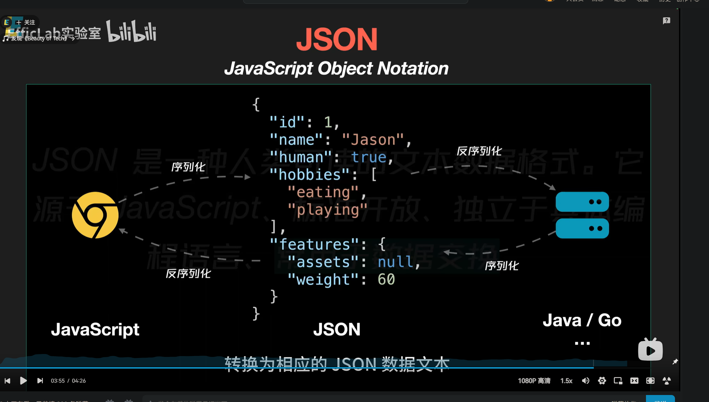

# 角色分析与排名

## 用户:
讲解一些json

## ChatGPT:
JSON（JavaScript Object Notation）是一种轻量级的数据交换格式，易于人类阅读和书写，同时也易于机器解析和生成。它广泛用于现代编程中，尤其是在前后端通信、API数据传输和配置文件中。

下面是对 JSON 的详细讲解：

---

### 1. **基本结构**
JSON 是一种基于键值对的结构化数据格式。它的语法非常简单，只包含以下几种类型：

#### **数据类型**
- **对象（Object）**：
  - 由花括号 `{}` 包裹，包含键值对。
  - 键（key）必须是字符串，值可以是任何合法的 JSON 数据类型。
  - 键值对用冒号 `:` 连接，多个键值对之间用逗号 `,` 分隔。

  **示例**：
  ```json
  {
    "name": "Alice",
    "age": 25,
    "isStudent": false
  }
  ```

- **数组（Array）**：
  - 由方括号 `[]` 包裹，包含一组有序的值。
  - 数组中的值可以是任意类型，包括对象或其他数组。

  **示例**：
  ```json
  [
    "apple",
    "banana",
    "cherry"
  ]
  ```

- **字符串（String）**：
  - 用双引号 `""` 包裹的一段文本。
  - 转义字符（如 `\"`、`\n`）可以用于特殊字符。

  **示例**：
  ```json
  "hello world"
  ```

- **数字（Number）**：
  - 可以是整数或浮点数。
  - 不需要引号包裹。

  **示例**：
  ```json
  42
  ```

- **布尔值（Boolean）**：
  - 只有两个值：`true` 或 `false`。

  **示例**：
  ```json
  true
  ```

- **空值（Null）**：
  - 表示空或无值。

  **示例**：
  ```json
  null
  ```

---

### 2. **嵌套结构**
JSON 可以通过嵌套对象和数组来表示复杂的数据结构。

**示例**：
```json
{
  "person": {
    "name": "Bob",
    "age": 30,
    "hobbies": ["reading", "gaming", "cycling"],
    "address": {
      "street": "123 Main St",
      "city": "New York",
      "zip": "10001"
    }
  }
}
```

在这个例子中：
- `person` 是一个对象。
- `hobbies` 是一个数组，包含字符串。
- `address` 是一个嵌套对象。

---

### 3. **JSON 的特点**
- **轻量级**：相比 XML，JSON 更简洁。
- **可读性强**：易于人类阅读和理解。
- **语言无关**：尽管名字中有 JavaScript，但 JSON 支持几乎所有编程语言。
- **易解析**：现代编程语言中都有内置的 JSON 解析库。

---

### 4. **常见用途**
- **API 数据传输**：
  前后端通过 JSON 格式传递数据。
  示例：
  ```json
  {
    "status": "success",
    "data": {
      "id": 101,
      "name": "John Doe"
    }
  }
  ```

- **配置文件**：
  JSON 常用作配置文件格式，如 `package.json`（用于 Node.js 项目）。
  示例：
  ```json
  {
    "name": "my-app",
    "version": "1.0.0",
    "dependencies": {
      "express": "^4.17.1"
    }
  }
  ```

- **存储结构化数据**：
  JSON 文件可以用来存储轻量级的结构化数据。

---

### 5. **注意事项**
- **键必须是字符串**：用双引号包裹。
  ```json
  { "key": "value" }
  ```

- **值不能是函数或 undefined**：JSON 不支持 JavaScript 的函数或 `undefined`。
  ```json
  // 错误
  { "key": undefined }
  ```

- **最后一个键值对后不能有逗号**：
  ```json
  // 错误
  {
    "name": "Alice",
    "age": 25,
  }
  ```

---

### 6. **JSON 与 JavaScript 的关系**
JSON 的语法与 JavaScript 的对象字面量非常相似，但有一些区别：
- JSON 的键必须用双引号包裹，而 JavaScript 的对象字面量可以省略。
- JSON 不支持函数、`undefined` 或特殊对象（如 `Date`）。

**示例**：
```javascript
// JavaScript 对象
const obj = {
  name: "Alice",
  age: 25,
  greet: function () {
    console.log("Hello!");
  }
};

// JSON 数据
const json = `{
  "name": "Alice",
  "age": 25
}`;
```

---

### 7. **解析与生成 JSON**
在编程中，JSON 通常通过解析（parse）和序列化（stringify）来使用。

#### **JavaScript 示例**：
```javascript
// JSON 字符串
const jsonString = '{"name":"Alice","age":25}';

// 解析 JSON 字符串为 JavaScript 对象
const obj = JSON.parse(jsonString);
console.log(obj.name); // 输出: Alice

// 将对象序列化为 JSON 字符串
const newJsonString = JSON.stringify(obj);
console.log(newJsonString); // 输出: {"name":"Alice","age":25}
```

---

### 总结
JSON 是一种简单而强大的数据格式，适用于各种场景。掌握 JSON 的基本语法和使用方法是现代编程的基础技能之一。如果你需要更深入了解某些特定用法或工具，可以告诉我，我会进一步讲解！



