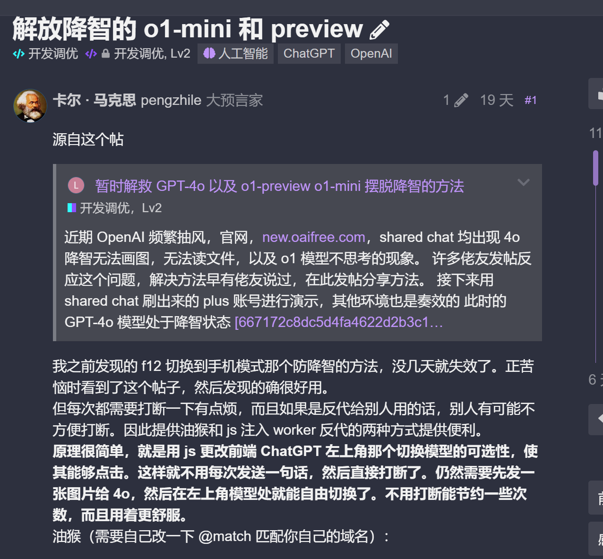
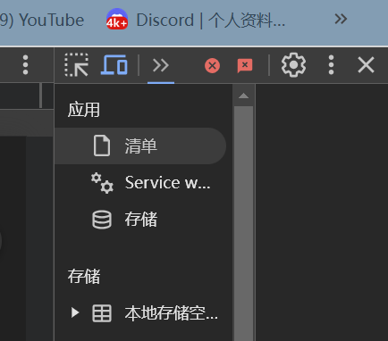

https://linux.do/t/topic/253619

// ==UserScript==
// @name         硬要换模型
// @namespace    http://tampermonkey.net/
// @version      1.0
// @description  解除oaifree模型切换限制，从而实现先在4o上传图片，然后切换到o1-mini来避免降智
// @author       Marx
// @match        https://*.oaifree.com/*
// @match        https://*.aivvm.com/*
// @icon         https://cdn.oaifree.com/assets/apple-touch-icon-mz9nytnj.webp
// @grant        none
// ==/UserScript==

(function() {
    'use strict';
    const classesToRemove = ['pointer-events-none', 'text-token-text-quaternary'];

    function processSpan(span) {
        if (span.getAttribute('data-state') !== 'closed') {
            return;
        }
        const firstDiv = span.querySelector('div');
        if (!firstDiv) return;

        let classChanged = false;

        classesToRemove.forEach(cls => {
            if (firstDiv.classList.contains(cls)) {
                firstDiv.classList.remove(cls);
                classChanged = true;
            }
        });

        if (classChanged) {
            unwrapElement(span);
        }
    }

    function unwrapElement(element) {
        const parent = element.parentNode;
        if (!parent) return;

        while (element.firstChild) {
            parent.insertBefore(element.firstChild, element);
        }
        parent.removeChild(element);
    }

    function processExistingSpans() {
        const spans = document.querySelectorAll('span[data-state="closed"]');
        spans.forEach(span => {
            processSpan(span);
        });
    }

    function setupMutationObserver() {
        const observer = new MutationObserver(mutations => {
            mutations.forEach(mutation => {
                mutation.addedNodes.forEach(node => {
                    if (node.nodeType !== Node.ELEMENT_NODE) return;

                    if (node.matches && node.matches('span[data-state="closed"]')) {
                        processSpan(node);
                    }

                    const spans = node.querySelectorAll && node.querySelectorAll('span[data-state="closed"]');
                    if (spans && spans.length > 0) {
                        spans.forEach(span => processSpan(span));
                    }
                });

                if (mutation.type === 'attributes' && mutation.target.matches('span[data-state="closed"]')) {
                    processSpan(mutation.target);
                }
            });
        });

        observer.observe(document.body, {
            childList: true,
            subtree: true,
            attributes: true,
            attributeFilter: ['data-state']
        });
    }

    function init() {
        processExistingSpans();
        setupMutationObserver();
    }

    if (document.readyState === 'loading') {
        document.addEventListener('DOMContentLoaded', init);
    } else {
        init();
    }

})();

worker fandai
export default {
  async fetch(request, env) {
    const INJECT_SCRIPT = `(function(){'use strict';const classesToRemove=['pointer-events-none','text-token-text-quaternary'];function processSpan(span){if(span.getAttribute('data-state')!=='closed'){return}const firstDiv=span.querySelector('div');if(!firstDiv)return;let classChanged=false;classesToRemove.forEach(cls=>{if(firstDiv.classList.contains(cls)){firstDiv.classList.remove(cls);classChanged=true}});if(classChanged){unwrapElement(span)}}function unwrapElement(element){const parent=element.parentNode;if(!parent)return;while(element.firstChild){parent.insertBefore(element.firstChild,element)}parent.removeChild(element)}function processExistingSpans(){const spans=document.querySelectorAll('span[data-state="closed"]');spans.forEach(span=>{processSpan(span)})}function setupMutationObserver(){const observer=new MutationObserver(mutations=>{mutations.forEach(mutation=>{mutation.addedNodes.forEach(node=>{if(node.nodeType!==Node.ELEMENT_NODE)return;if(node.matches&&node.matches('span[data-state="closed"]')){processSpan(node)}const spans=node.querySelectorAll&&node.querySelectorAll('span[data-state="closed"]');if(spans&&spans.length>0){spans.forEach(span=>processSpan(span))}});if(mutation.type==='attributes'&&mutation.target.matches('span[data-state="closed"]')){processSpan(mutation.target)}})});observer.observe(document.body,{childList:true,subtree:true,attributes:true,attributeFilter:['data-state']})}function init(){processExistingSpans();setupMutationObserver()}if(document.readyState==='loading'){document.addEventListener('DOMContentLoaded',init)}else{init()}})();`;
    const url = new URL(request.url);
    url.hostname = 'new.oaifree.com';
    const modifiedRequest = new Request(url, request);
    const response = await fetch(modifiedRequest);
    const contentType = response.headers.get('Content-Type') || '';

    if (contentType.includes('text/html')) {
      let body = await response.text();
      const closingBodyTag = '</body>';
      const scriptTag = ``;

      if (body.includes(closingBodyTag)) {
        body = body.replace(closingBodyTag, `${scriptTag}\n${closingBodyTag}`);
      } else {
        body += scriptTag;
      }

      return new Response(body, {
        status: response.status,
        statusText: response.statusText,
        headers: response.headers
      });
    }

    return response;
  }
}

gpt 评价 :
功能详解
移除特定CSS类：

classesToRemove 数组中列出了需要移除的CSS类：'pointer-events-none' 和 'text-token-text-quaternary'。
这些类可能用于禁用某些交互或改变元素的样式，通过移除它们，可以恢复原本被限制的功能或外观。
处理特定的  元素：

processSpan 函数：
选择所有 data-state="closed" 的  元素。
检查其第一个子 
 是否存在。
移除指定的CSS类。
如果有类被移除，则调用 unwrapElement 函数将  元素解包，即移除  标签但保留其子元素。
解包元素：

unwrapElement 函数：
将目标元素的所有子节点插入到其父节点之前。
最后移除目标元素本身。
处理现有的  元素：

processExistingSpans 函数：
在页面加载完成后，立即处理所有现有的符合条件的  元素。
设置MutationObserver：

setupMutationObserver 函数：
监视整个文档的DOM变化，包括子节点的添加和属性的变化。
当有新的符合条件的  元素被添加到DOM中，或者现有元素的 data-state 属性发生变化时，调用 processSpan 进行处理。
初始化脚本：

init 函数：
调用 processExistingSpans 处理现有元素。
设置MutationObserver以监视未来的变化。
脚本会在DOM内容加载完成后自动执行 init 函数。
潜在影响与注意事项
功能性：通过移除特定的CSS类和解包元素，脚本可能绕过网站对模型切换的限制，使用户能够自由切换模型或执行原本被禁用的操作。

稳定性：脚本直接修改DOM结构和样式，可能导致网站其他功能异常，特别是在网站更新后，原有的DOM结构或CSS类名发生变化时，脚本可能失效或引发错误。

法律与道德：绕过网站限制可能违反网站的使用条款。用户在使用此类脚本时，应确保不侵犯网站的合法权益，并承担相应的风险。

安全性：虽然脚本本身没有请求外部资源或执行敏感操作，但用户仍需确保脚本来源可信，以避免潜在的安全风险。

总结
该油猴脚本通过移除特定的CSS类和解包特定的  元素，成功绕过 oaifree 网站的模型切换限制，实现了在不同模型之间的灵活切换。然而，用户在使用此类脚本时，应谨慎评估其潜在影响，并确保其行为符合相关法律法规和网站的使用条款。

新方法: 
- 4o 
    发张图片让他描述  Describing images 回复智力
- o1 
    发张图片让他描述 回复智力
    然后发个文字 在回答途中打断 以能够切换模型
    

下面办法被openai发现 已经取缔

- 每次oopenai发布新模型前期总会给现有的模型进行风控降智此时的解决办法
用手机打开 chatgpt
chrome浏览器按f12 左上角打开手机设备 进行即可解除降智

