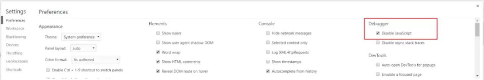
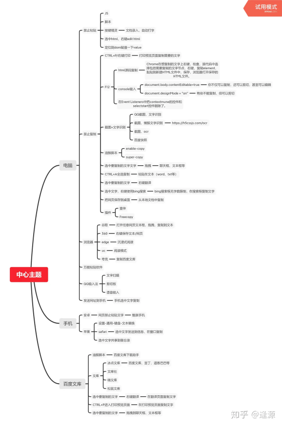

https://zhuanlan.zhihu.com/p/360282992
前言，逢源是我以前的一个号，现在已经注销不用了，这个是新号~

以下是原文章：

如题。

背景：前几天做作业，提交作业的时候发现不能使用粘贴功能。禁止粘贴的话就等于我要手动码字，对于一个身在经济学心在计科的我来说，绝对不可能乖乖地再码一次字！

于是，我就开始一系列搜索。

朱丹老师说过，"世界上99%的问题都可以通过搜索解决，剩下的1%交给哲学"。

亦仁老师说过，"一搜二问三尝试，基本所有的问题搜索引擎里都有答案"。

通过搜索，我发现一些网页的禁止粘贴是通过 js（Javascript）达到禁止粘的目的，所以想要复制粘贴得关闭js（Javascript）。

具体操作如下（以Google chrome为例）：

1.在谷歌浏览器的任一页面，点击右键，选择检查选项。

2.点击右上角框选择，将控制台置于页面下方

3.点击setting，找到debugger-disable Javascript，勾选

快捷键操作：F12→FI→（打勾）Javascript

然后就能发现页面的粘贴选项可以用了，记得用完取消勾选disable-Javascript，需要的时候才开启~

另外，我又整理了一张图，里面是跳过网页禁止复制粘贴的方法大全，不敢说最全，但应该是较全面的了叭（可能整理的还不是很好，要是有错误的地方大家可以给我指出来，非常感谢~）
