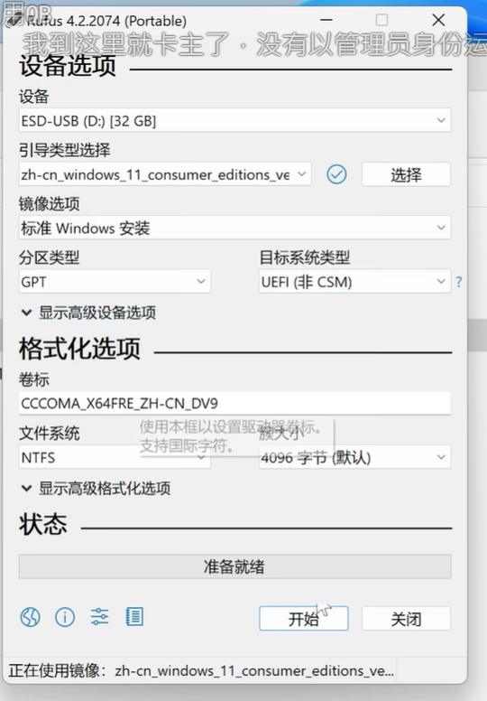
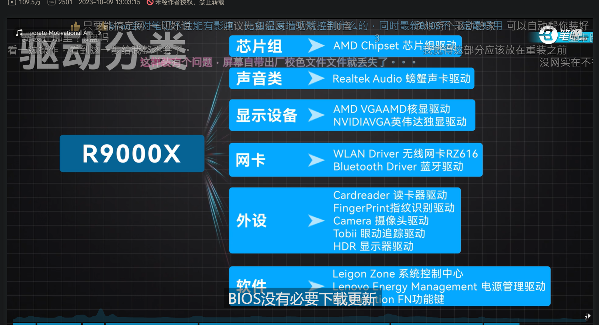

联想 https://newsupport.lenovo.com.cn/notebook.html
123456

https://www.bilibili.com/video/BV16h4y1B7md/?spm_id_from=333.337.top_right_bar_window_default_collection.content.click&vd_source=4b9929a93a68ea46743a8ef1b0d86cba

1.下载系统优盘安装工具
2.下载系统到优盘
3.用安装工具拷贝到优盘
4.打开bois工具让电脑优盘方式打开
5.安装完优盘安装驱动
